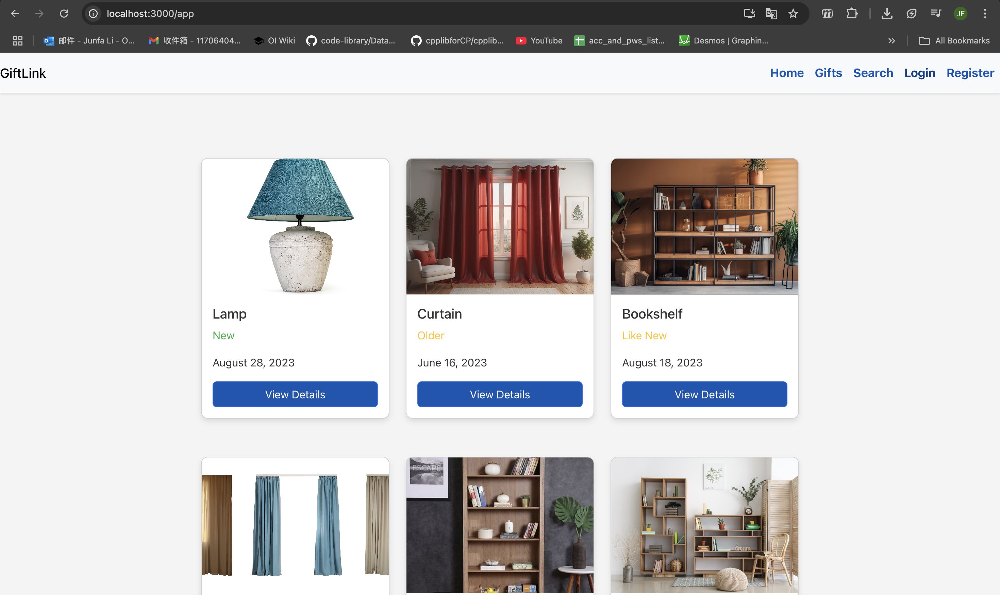
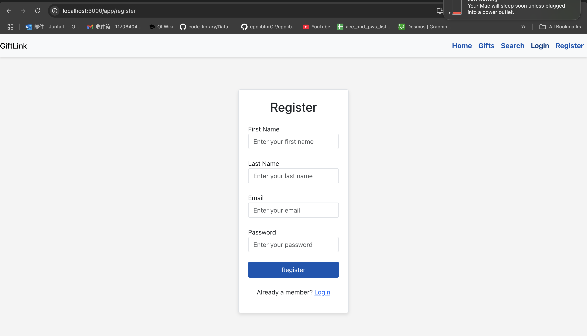
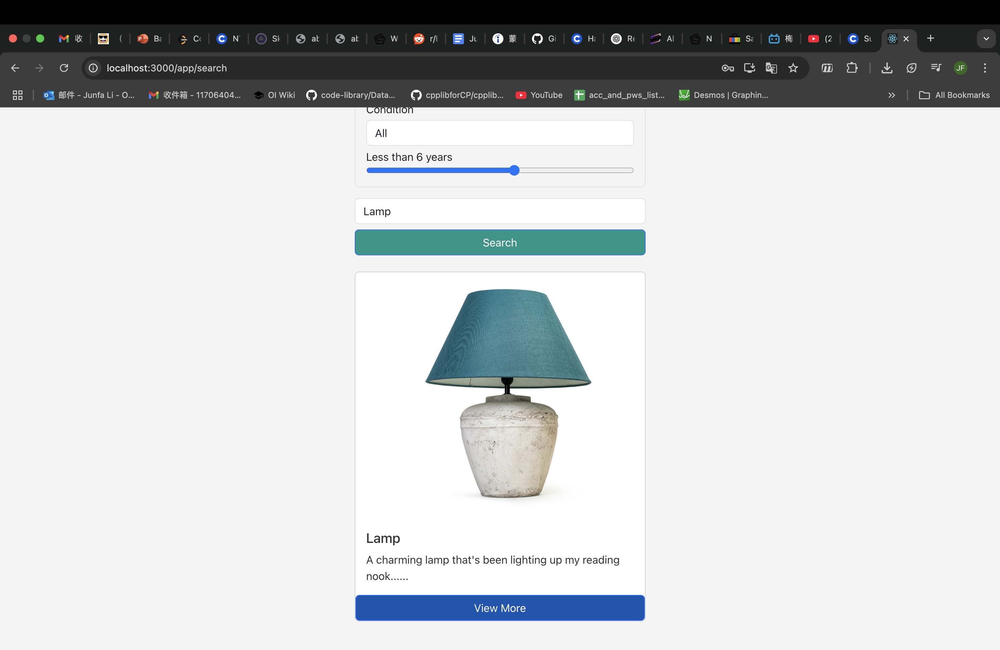
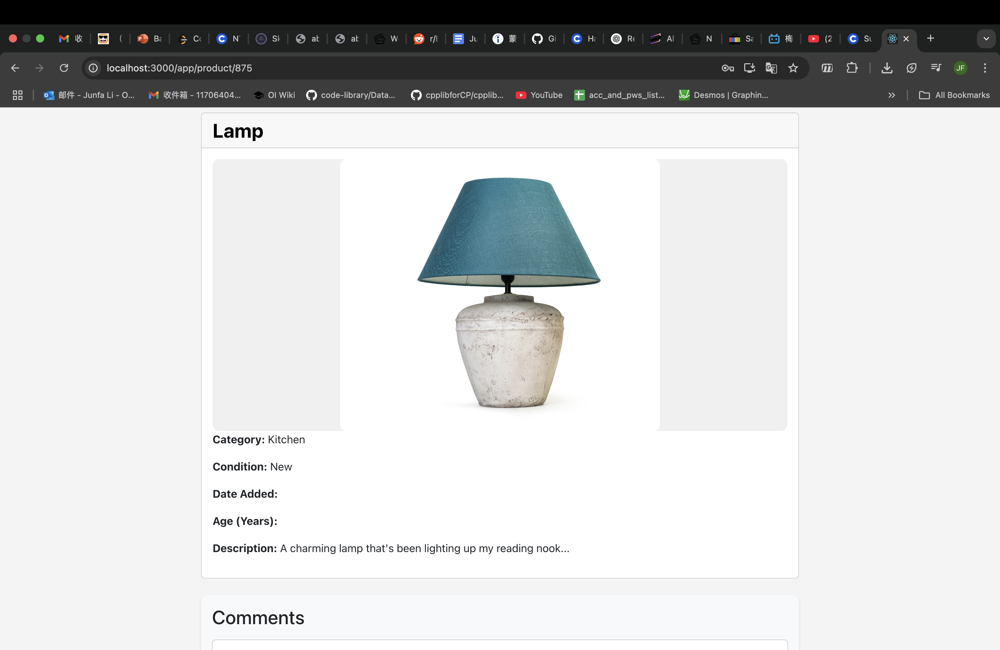

# Giftlink 🎁

A full-stack web application that connects people by allowing them to give and receive free second-hand gifts. Designed with love and built with modern web technologies.

---

## ✨ Features

- 🔒 User authentication with JWT
- 🎁 Gift listing with category, condition, image & description
- 🔍 Filter and search gifts by name, category, condition, and age
- 📄 Detailed view for each gift item
- 🧑 Profile management and editing
- ❤️ Sentiment analysis microservice (experimental)

---

## 🗂️ Tech Stack

### Backend
- **Node.js**, **Express.js**
- **MongoDB** via native driver
- **Pino** for structured logging
- **dotenv**, **cors**, **express-validator**, **jsonwebtoken**

### Frontend
- **React.js**, **React Router**
- **Bootstrap 5**
- **Context API** for auth state

### Microservices
- 🧠 **Sentiment Analysis API** using `natural` NLP library (Enhancing the Search Functionality)

### 🛣️ Roadmap

✅ Main Page

✅ Register Page

✅ Search Page

✅ Details Page

